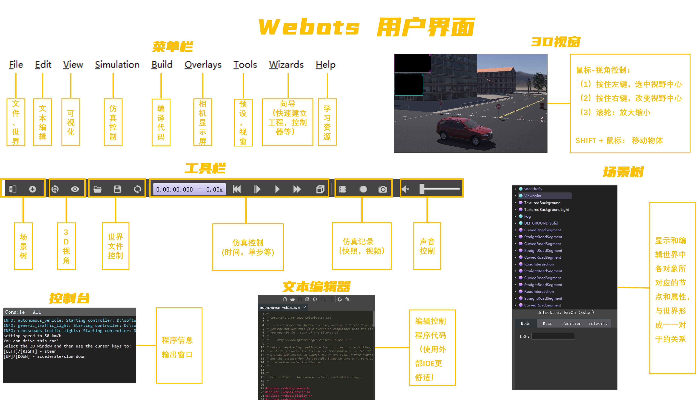
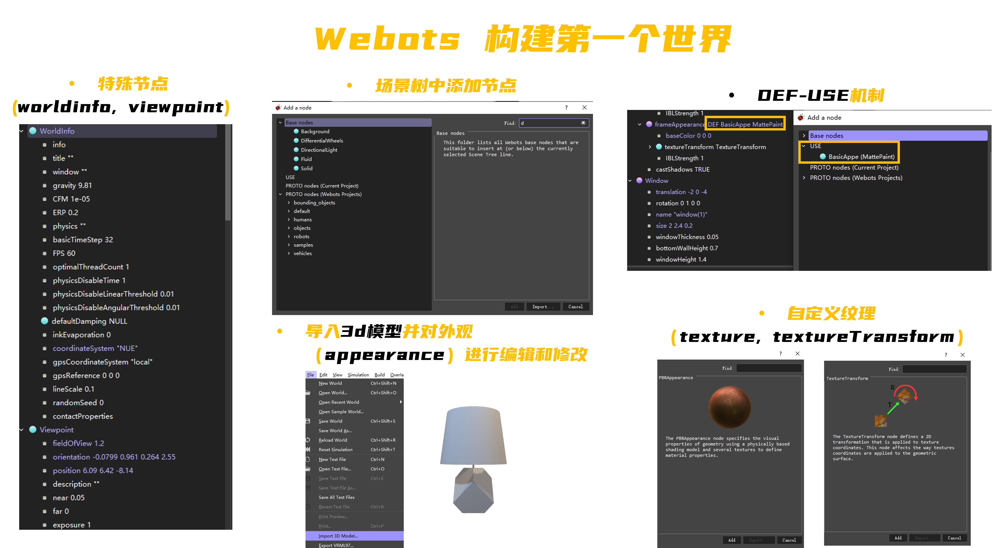
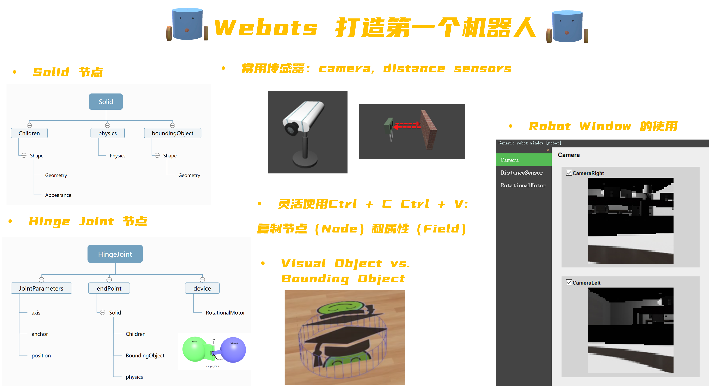
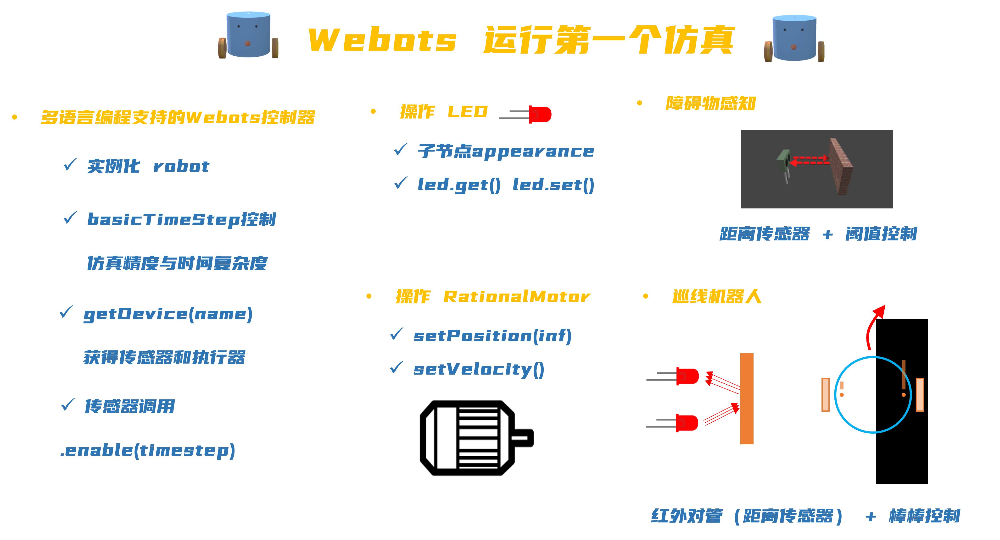

## Webots Tutorial for Beginners 

Source code and project files used in the [video tutorial](https://www.bilibili.com/video/BV1BY411K7SC) of the webots in Bilibili.

### s0: introdution to Robot simulation softwares and Webots
### s1: basic UI operation
  
### s2: constrcucting a lab
  
### s3: build a two wheeled robot from scratch
  
### s4: running your first robot simulation
  
### s5: introduce `supervisor`, a powerful tool in Webots

#### For more interesting videos related to robots/AI/Bioinspiration, see my [Bilibili Channel](https://space.bilibili.com/13031745)

### stars:

<iframe style="width:100%;height:auto;min-width:600px;min-height:400px;" src="https://star-history.com/embed?secret=Z2hwX0hsWFdDdkdPaXVBQXE0YTVhUHFQS1ZLR3JLbnFJVzNWVWZOQg==#XuelongSun/WebotsTutorialBilibili&Date" frameBorder="0"></iframe>
